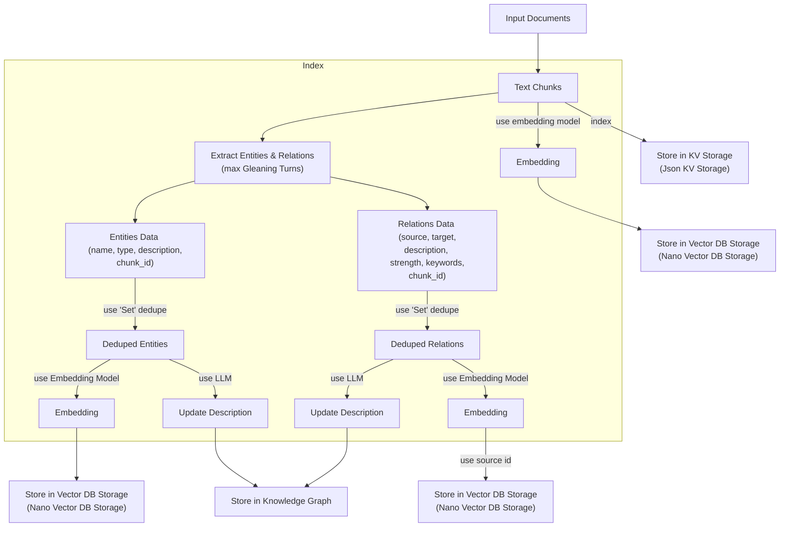
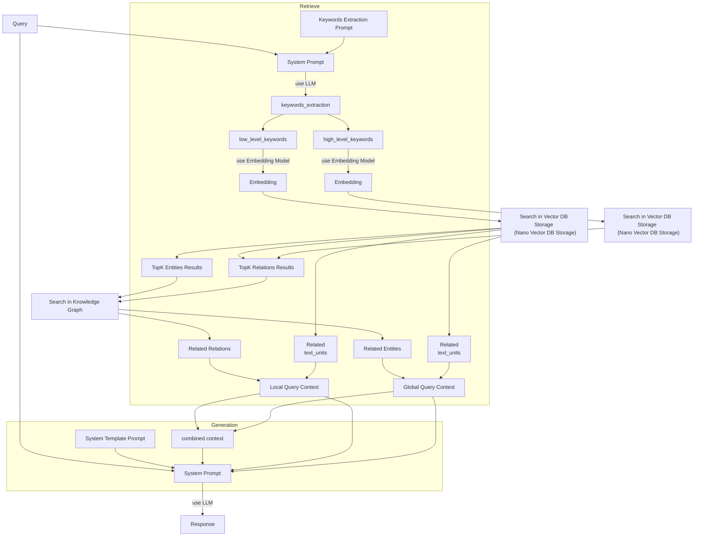

# Indexing Flowchart 

```mermaid
graph TD
    %% 1. Input
    A[Input Documents] --> B

    %% 2. Main Processing Block
    subgraph Index
        B[Text Chunks]

        %% 2a. Text Chunks to Vector DB
        B -- use embedding model --> C[Embedding]

        %% 2b. Text Chunks to Extraction
        B --> D["Extract Entities & Relations <br/> (max Gleaning Turns)"]

        D --> E["Entities Data <br/> (name, type, description, chunk_id)"]
        D --> F["Relations Data <br/> (source, target, description, <br/> strength, keywords, chunk_id)"]

        %% 3. Entities Path
        E -- "use 'Set' dedupe" --> G[Deduped Entities]
        G -- use Embedding Model --> H[Embedding]
        G -- use LLM --> I[Update Description]

        %% 4. Relations Path
        F -- "use 'Set' dedupe" --> J[Deduped Relations]
        J -- use Embedding Model --> K[Embedding]
        J -- use LLM --> L[Update Description]
    end

    %% 5. Final Storage Connections
    B -- index --> O1["Store in KV Storage <br/> (Json KV Storage)"]
    C --> O5["Store in Vector DB Storage <br/> (Nano Vector DB Storage)"]
    H --> O3["Store in Vector DB Storage <br/> (Nano Vector DB Storage)"]
    I --> O4[Store in Knowledge Graph]
    K -- use source id --> O2["Store in Vector DB Storage <br/> (Nano Vector DB Storage)"]
    L --> O4
```

# Retrieval and Querying Flowchart

```mermaid
graph TD
    %% ==================================
    %%  1. DEFINISI SEMUA NODE
    %% ==================================

    %% -- Inputs --
    A[Query]
    

    %% -- Node Eksternal (DI LUAR SUBGRAPH) --
    VDB1["Search in Vector DB Storage <br/> (Nano Vector DB Storage)"]
    VDB2["Search in Vector DB Storage <br/> (Nano Vector DB Storage)"]
    KG["Search in Knowledge Graph"]
    S[Response]

    %% -- Node di dalam Subgraph Retrieve --
    B[Keywords Extraction Prompt]
    C_Ret[System Prompt]
    D[keywords_extraction]
    E[low_level_keywords]
    F[high_level_keywords]
    G[Embedding]
    H[TopK Entities Results]
    I[Related Relations]
    J["Related <br/> text_units"]
    K[Local Query Context]
    L[Embedding]
    M[TopK Relations Results]
    N[Related Entities]
    O["Related <br/> text_units"]
    P[Global Query Context]

    %% -- Node di dalam Subgraph Generation --
    Q[combined context]
    R_Gen[System Prompt]
    A1[System Template Prompt]


    %% ==================================
    %%  2. PENEMPATAN NODE KE SUBGRAPH
    %% ==================================

    subgraph Retrieve
        B; C_Ret; D; E; F; G; H; I; J; K; L; M; N; O; P;
    end

    subgraph Generation
        Q; R_Gen; A1
    end


    %% ==================================
    %%  3. SEMUA KONEKSI ANTAR NODE
    %% ==================================

    %% -- Alur Input --
    A --> C_Ret
    A --> R_Gen
    A1 --> R_Gen

    %% -- Alur di dalam Retrieve --
    B --> C_Ret
    C_Ret -- use LLM --> D
    D --> E
    D --> F
    
    %% -- Alur Low-Level --
    E -- use Embedding Model --> G
    G --> VDB1
    VDB1 --> H
    H --> KG
    KG --> I
    VDB1 --> J
    I --> K
    J --> K

    %% -- Alur High-Level --
    F -- use Embedding Model --> L
    L --> VDB2
    VDB1 --> M
    VDB2 --> M
    M --> KG
    KG --> N
    VDB1 --> O
    N --> P
    O --> P
    
    %% -- Alur di dalam Generation --
    K --> Q
    P --> Q
    Q --> R_Gen
    K --> R_Gen
    P --> R_Gen

    %% -- Alur Output --
    R_Gen -- use LLM --> S
```
