# Sistem Hukum Indonesia

Diagram ini menggambarkan struktur sistem hukum Indonesia yang terdiri dari dua komponen utama:

## 🏛️ Sistem Peradilan
- **Peradilan Agama**: Mahkamah Syariah, Pengadilan Agama, Pengadilan Tinggi Agama
- **Peradilan Tata Usaha Negara**: Pengadilan Pajak, PTUN, PTTUN
- **Peradilan Militer**: DILMIL, DILMILTI, DILMILTAMA
- **Peradilan Umum**: Mahkamah Agung, Pengadilan Tinggi, Pengadilan Negeri

## ⚖️ Klasifikasi Hukum
### Hukum Pidana
- Jenis: Kejahatan dan Pelanggaran
- Putusan: Pidana Pokok dan Tambahan
- Klasifikasi: Pidana Umum, Khusus, dan Militer

### Hukum Perdata
- Jenis: Hukum Keluarga, Harta Kekayaan, Benda, Perikatan, Waris
- Putusan: Declaratoir, Constitutif, Condemnatoir
- Klasifikasi: Sengketa Mengadili, Perdata Khusus, Agama, dan Lainnya

---

```mermaid
graph RL
    HUKUM((HUKUM))

    %% HUKUM sebagai jembatan antara PERADILAN dan KLASIFIKASI
    HUKUM --- Peradilan((PERADILAN))
    HUKUM --- PENGELOMPOKAN[PENGELOMPOKAN]

    %% --- BAGIAN PERADILAN ---
    Peradilan --- Peradilan_Agama(Peradilan Agama)
    Peradilan --- Peradilan_TUN(Peradilan Tata Usaha Negara)
    Peradilan --- Peradilan_Militer(Peradilan Militer)
    Peradilan --- Peradilan_Umum(Peradilan Umum)

    subgraph "Sistem Peradilan Agama"
        direction RL
        Mahkamah_Syariah[Mahkamah Syariah]
        Pengadilan_Agama[Pengadilan Agama]
        Pengadilan_Tinggi_Agama[Pengadilan Tinggi Agama]
    end

    subgraph "Sistem Peradilan Tata Usaha Negara"
        direction RL
        Pengadilan_Pajak[Pengadilan Pajak]
        PTUN[PTUN]
        PTTUN[PTTUN]
    end

    subgraph "Sistem Peradilan Militer"
        direction RL
        DILMIL[DILMIL]
        DILMILTI[DILMILTI]
        DILMILTAMA[DILMILTAMA]
    end

    subgraph "Sistem Peradilan Umum"
        direction RL
        Mahkamah_Agung[Mahkamah Agung]
        Pengadilan_Tinggi[Pengadilan Tinggi]
        Pengadilan_Negeri[Pengadilan Negeri]
    end

    %% Koneksi Peradilan
    Mahkamah_Syariah --- Peradilan_Agama
    Pengadilan_Agama --- Peradilan_Agama
    Pengadilan_Tinggi_Agama --- Peradilan_Agama

    Pengadilan_Pajak --- Peradilan_TUN
    PTUN --- Peradilan_TUN
    PTTUN --- Peradilan_TUN

    DILMIL --- Peradilan_Militer
    DILMILTI --- Peradilan_Militer
    DILMILTAMA --- Peradilan_Militer

    Mahkamah_Agung --- Peradilan_Umum
    Pengadilan_Tinggi --- Peradilan_Umum
    Pengadilan_Negeri --- Peradilan_Umum

    %% --- BAGIAN KLASIFIKASI ---
    PENGELOMPOKAN --- Perdata[Perdata]
    PENGELOMPOKAN --- Pidana[Pidana]

    %% --- PIDANA SECTION ---
    Pidana --- Pidana_Jenis[Jenis]
    Pidana --- Pidana_Putusan[Putusan]
    Pidana --- Pidana_Klasifikasi[Klasifikasi]

    %% Jenis Pidana
    subgraph "Jenis Hukum Pidana"
        direction RL
        Pidana_Jenis --- Kejahatan[Kejahatan]
        Pidana_Jenis --- Pelanggaran[Pelanggaran]
    end

    %% Putusan Pidana
    subgraph "Sistem Putusan Pidana"
        direction RL
        Pidana_Putusan --- Pidana_Pokok[Pidana Pokok]
        Pidana_Putusan --- Pidana_Tambahan[Pidana Tambahan]

        %% Detail Pidana Pokok
        Pidana_Pokok --- Pidana_Mati[Pidana Mati]
        Pidana_Pokok --- Pidana_Denda[Pidana Denda]
        Pidana_Pokok --- Pidana_Kurungan[Pidana Kurungan]
        Pidana_Pokok --- Pidana_Penjara[Pidana Penjara]
        Pidana_Pokok --- Pidana_Tutupan[Pidana Tutupan]

        %% Detail Pidana Tambahan
        Pidana_Tambahan --- Pencabutan_Hak[Pencabutan hak-hak tertentu]
        Pidana_Tambahan --- Perampasan_Barang[Perampasan barang-barang tertentu]
        Pidana_Tambahan --- Pengumuman_Putusan[Pengumuman putusan hakim]
    end

    %% Klasifikasi Pidana
    subgraph "Klasifikasi Hukum Pidana"
        direction RL
        Pidana_Klasifikasi --- Pidana_Umum[Pidana Umum]
        Pidana_Klasifikasi --- Pidana_Khusus[Pidana Khusus]
        Pidana_Klasifikasi --- Pidana_Militer[Pidana Militer]

        %% Detail Pidana Umum
        Pidana_Umum --- Pencurian[Pencurian]
        Pidana_Umum --- Penggelapan[Penggelapan]
        Pidana_Umum --- Penipuan[Penipuan]

        %% Detail Pidana Khusus
        Pidana_Khusus --- Narkotika[Narkotika]
        Pidana_Khusus --- Korupsi[Korupsi]
        Pidana_Khusus --- Anak[Anak]

        %% Detail Pidana Militer
        Pidana_Militer --- Disersi[Disersi]
        Pidana_Militer --- Subordinasi[Subordinasi]
        Pidana_Militer --- Kesusilaan[Kesusilaan]
    end

    %% --- PERDATA SECTION ---
    Perdata --- Perdata_Jenis[Jenis]
    Perdata --- Perdata_Putusan[Putusan]
    Perdata --- Perdata_Klasifikasi[Klasifikasi]

    %% Jenis Perdata
    subgraph "Jenis Hukum Perdata"
        direction RL
        Perdata_Jenis --- Hukum_Keluarga[Hukum Keluarga]
        Perdata_Jenis --- Hukum_Harta[Hukum harta kekayaan]
        Perdata_Jenis --- Hukum_Benda[Hukum Benda]
        Perdata_Jenis --- Hukum_Perikatan[Hukum perikatan]
        Perdata_Jenis --- Hukum_Waris[Hukum Waris]
    end

    %% Putusan Perdata
    subgraph "Sistem Putusan Perdata"
        direction RL
        Perdata_Putusan --- Putusan_Declaratoir[Putusan Declaratoir]
        Perdata_Putusan --- Putusan_Constitutif[Putusan Constitutif]
        Perdata_Putusan --- Putusan_Condemnatoir[Putusan Condemnatoir]
    end

    %% Klasifikasi Perdata
    subgraph "Klasifikasi Hukum Perdata"
        direction RL
        Perdata_Klasifikasi --- Sengketa_Mengadili[Sengketa Mengadili]
        Perdata_Klasifikasi --- Perdata_Khusus_Klas[Perdata Khusus]
        Perdata_Klasifikasi --- Perdata_Agama_Klas[Perdata Agama]
        Perdata_Klasifikasi --- Perdata_Lain[Perdata]

        %% Detail Sengketa Mengadili
        Sengketa_Mengadili --- Pajak[Pajak]
        Sengketa_Mengadili --- TUN[TUN]

        %% Detail Pajak
        Pajak --- Pajak_Pertambahan[Pajak Pertambahan Nilai]
        Pajak --- Bea_Masuk[Bea Masuk]
        Pajak --- Pajak_Penghasilan[Pajak Penghasilan]

        %% Detail TUN
        TUN --- Kepegawaian[Kepegawaian]
        TUN --- Perizinan[Perizinan]
        TUN --- Badan_Hukum[Badan Hukum]

        %% Detail Perdata Khusus
        Perdata_Khusus_Klas --- Kepailitan[Kepailitan]
        Perdata_Khusus_Klas --- Perlindungan_Konsumen[Perlindungan Konsumen]
        Perdata_Khusus_Klas --- Merek_Dagang[Merek Dagang]

        %% Detail Perdata Agama
        Perdata_Agama_Klas --- Perceraian[Perceraian]
        Perdata_Agama_Klas --- Waris[Waris]
        Perdata_Agama_Klas --- Pengesahan_Nikah[Pengesahan Nikah]

        %% Detail Perdata Lain
        Perdata_Lain --- Tanah[Tanah]
        Perdata_Lain --- Permohonan[Permohonan]
        Perdata_Lain --- Wanprestasi[Wanprestasi]
    end
```

